<p align="center">
    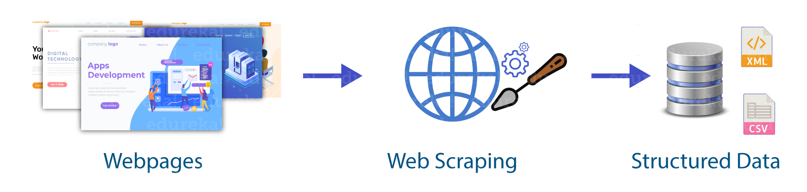
    
    
    
</p>


# Pricing Service

## Table of Contents
- [Introduction](#introduction)
- [Features](#features)
- [Launch](#launch)
- [Screenshots](#screenshots)
- [Technologies](#technologies)

## Introduction
Pricing Service is a Python Flask web application that allows you track items of online stores and be notified by email if the item has dropped below a user set minimum price.

## Features
- Scrapes e-commerce websites, including:
    - John Lewis
    - Ikea
    - Nike
    - EB Games
- User can create/edit their profile.
- User may view availale stores that they wish to track the items of.
- User may track a desired item from an avaiable store by creating an Alert.
    - Alerts have a minimum price for their corresponding item.
    - If an alert's item drops below its minimum price, the user is notified by email.
    - Alert on user's alert list will indicate if an item has dropped below its minimum price with a visible message.
    - User may edit Alerts.
- Administrators may add new stores to the stores list.
- [Extensive documentation website](https://nikelausm.github.io/pricing-service/) built with [Sphinx](https://www.sphinx-doc.org/en/master/).

## Launch
### Setup
To install necessary virtual environment, in a terminal enter:
```
pipenv install
```
To activate virtual environment needed to run application, in a terminal enter:
```
pipenv shell
```
To run application, in a terminal enter:
```
python app.py
```
### Deployment
[Check out the website!](https://pricing-service-nikelausm.herokuapp.com/)

#### Deployment Diagram
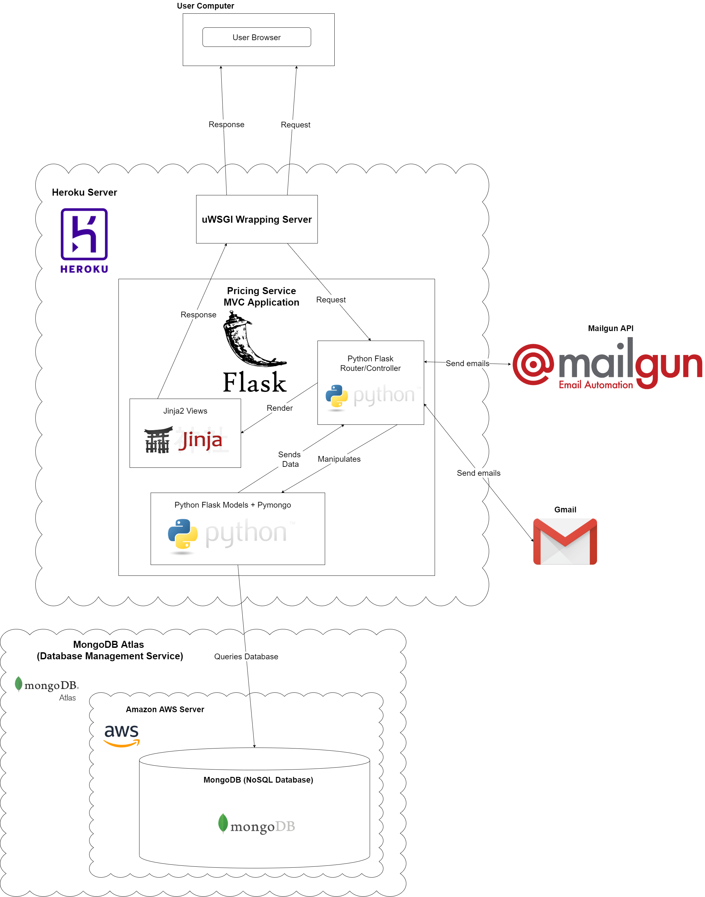

## Screenshots
### Landing Page
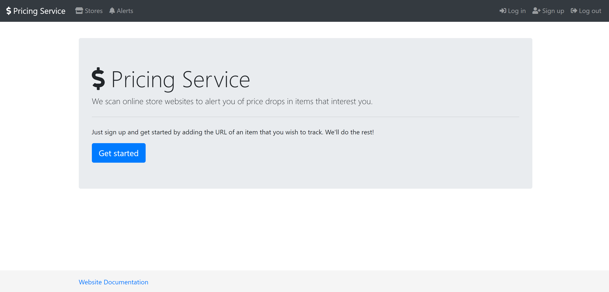

### Register
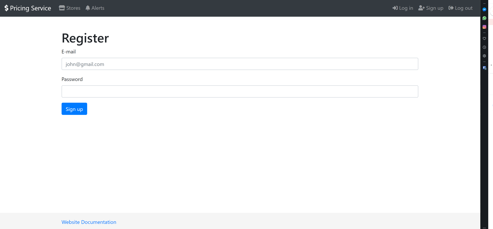

### Login
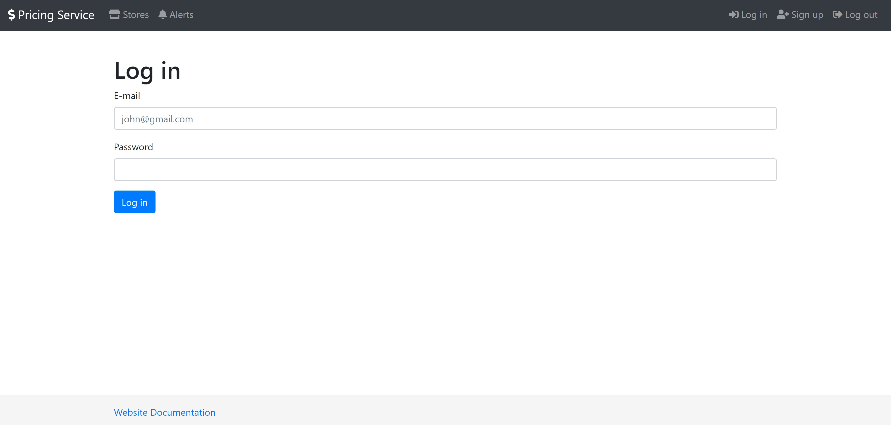

### Stores List Page
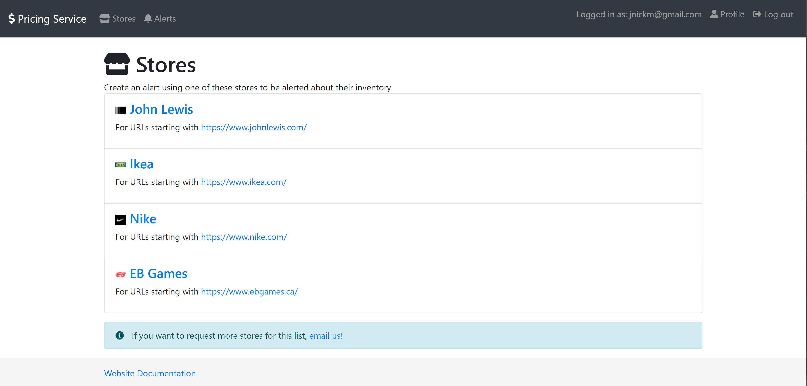

### Create Alert
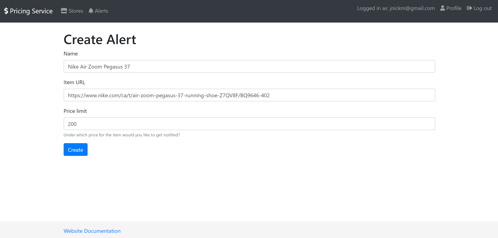

### Alerts List Page After Alert Created
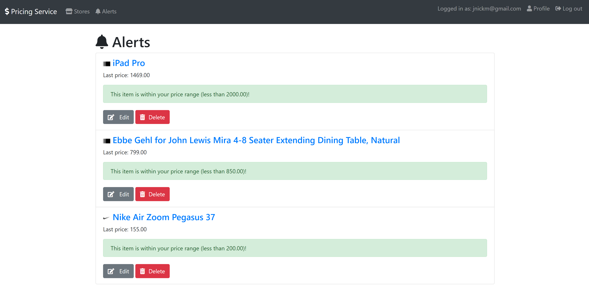

### Email Notification
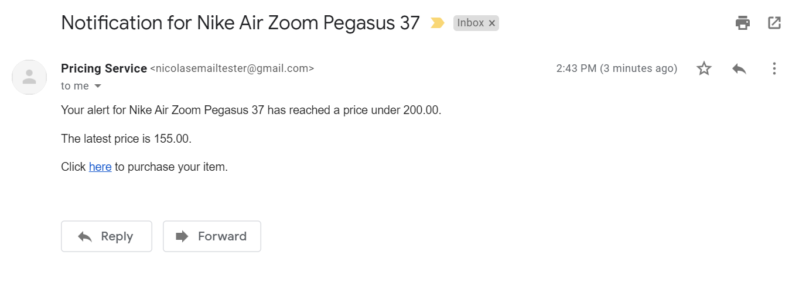

### [Documentation Website](https://nikelausm.github.io/pricing-service/) Built With [Sphinx](https://www.sphinx-doc.org/en/master/)
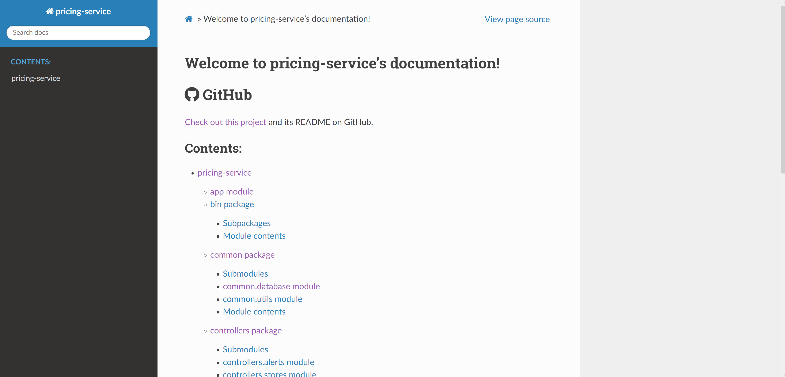

### Docs Website Example Page
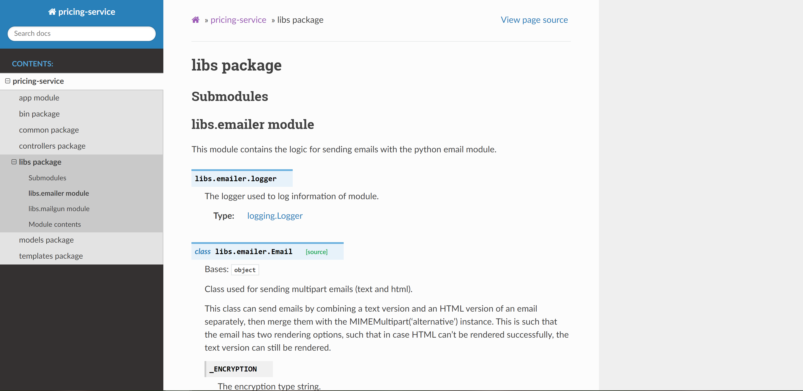

## Technologies
- [Python version 3.8.3](https://www.python.org/downloads/release/python-383/)
- [Flask version 1.1.2](https://flask.palletsprojects.com/en/1.1.x/)
    - Python web development framework.
- [Jinja2 version 2.11.2](https://jinja.palletsprojects.com/en/2.11.x/)
    - Templating language for Python, modelled after Django's templates.
- [Werkzeug](https://werkzeug.palletsprojects.com/en/1.0.x/)
    - A [WSGI](https://wsgi.readthedocs.io/en/latest/) web application library.
- [uWSGI](https://uwsgi-docs.readthedocs.io/en/latest/)
    - The application server.
- [BeautifulSoup4 version 4.9.1](https://pypi.org/project/beautifulsoup4/)
    - Allows a web page to be scraped (parses its HTML or XML)
- [requests version 2.24.0](https://pypi.org/project/requests/)
    - Allows sending HTTP requests
- [Pymongo version 3.11.0](https://pymongo.readthedocs.io/en/stable/)
    - Python module for working with MongoDB.
- [MongoDB](https://www.mongodb.com)
    - General purpose, document-based database (NoSQL).
- [Mailgun API](https://documentation.mailgun.com/en/latest/quickstart-sending.html#)
    - An API I first used for sending emails.
- Gmail SMTP
    - I transitioned to using a [custom email class](https://github.com/NikelausM/pricing-service/blob/master/libs/emailer.py) that uses SMTP TLS to send email with Gmail.
- [Sphinx version 3.2.1](https://www.sphinx-doc.org/en/master/)
    - Python documentation website generator.
- [logging](https://docs.python.org/3/library/logging.html)
    - Allows for logging information.
- [time](https://docs.python.org/3/library/time.html)
    - For timing code execution time.
