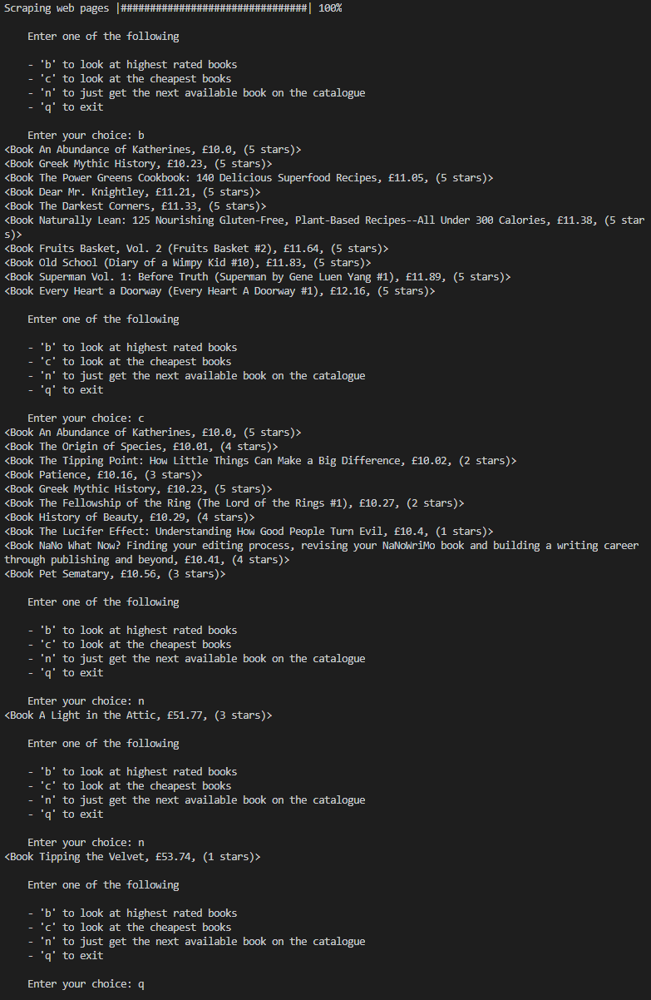

<p align="center">
    
    
    
    
</p>


# Pricing Service

## Table of Contents
- [Introduction](#introduction)
- [Features](#features)
- [Screenshots](#screenshots)
- [Launch](#launch)
- [Technologies](#technologies)

## Introduction
Pricing Service is a Python Flask web application that allows you track items of online stores and be notified by email if the item has dropped below a user set minimum price.

## Features
- Scrapes the e-commerce websites
- User can create/edit their profile.
- User may view availale stores that they wish to track the items of.
- User may track a desired item from an avaiable store by creating an Alert.
    - Alerts have a minimum price for their corresponding item.
    - If an alert's item drops below its minimum price, the user is notified by email.
    - Alert on user's alert list will indicate if an item has dropped below its minimum price with a visible message.
    - User may edit Alerts
- CRON jobs are used to notify the User by email periodically if an item has dropped below its minimum price.
    - This feature has been deprecated.
- Administrators may add new stores to the stores list.

## Screenshots
### Screenshot of Stores List Page


### Screenshot of Alerts List Page


### Screenshot of Email Notification


## Launch
### Setup
To install necessary virtual environment, in a terminal enter:
```
pipenv install
```
To activate virtual environment needed to run application, in a terminal enter:
```
pipenv shell
```
To run application, in a terminal enter:
```
python app.py
```

## Technologies
- [Python 3.8.3](https://www.python.org/downloads/release/python-383/)
### Python Modules
- [BeautifulSoup4](https://pypi.org/project/beautifulsoup4/)
    - Allows a web page to be scraped (parses its HTML or XML)
- [requests](https://pypi.org/project/requests/)
    - Allows sending HTTP requests
- [logging](https://docs.python.org/3/library/logging.html)
    - Allows for logging information.
- [time](https://docs.python.org/3/library/time.html)
    - For timing code execution time.
